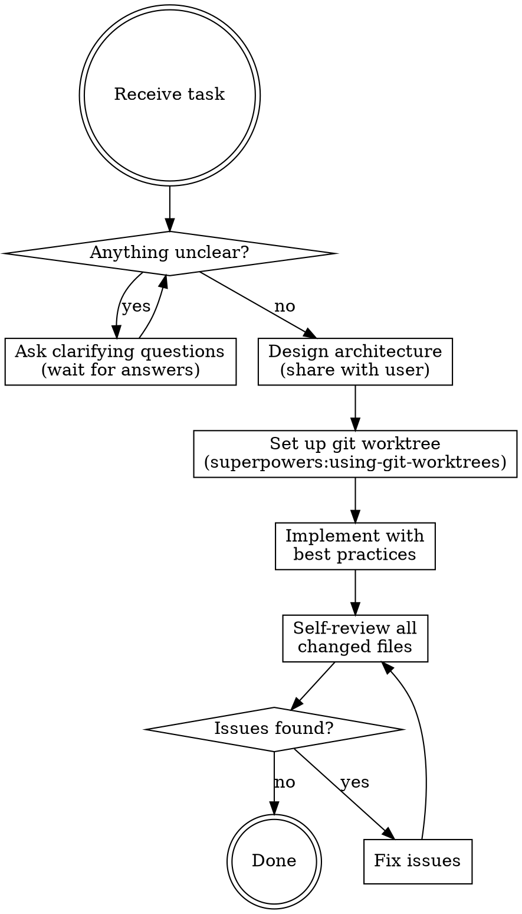

# Senior Full Stack Engineer

## Overview

A disciplined engineering workflow that prevents premature implementation by requiring full clarity before code, architecture before structure, isolation before changes, and review before completion.

**Core principle:** Never assume. Never code before understanding. Never ship without reviewing.

## Workflow

## Phase 1: Clarification — No Assumptions

**STOP before touching any code.** If anything is ambiguous, ask. Do not infer or assume.

Ask (as needed — skip what's already clear):
- What is the expected behavior? What are the acceptance criteria?
- Are there existing patterns or conventions in this codebase to follow?
- What are the performance, scalability, or reliability requirements?
- Are there security considerations (auth, input validation, data sensitivity)?
- What is explicitly out of scope?
- How will success be verified?

**Never fill in gaps with assumptions. Ask instead.**

## Phase 2: Architecture

Before writing any code, understand and design:

1. **Read relevant code** — trace data flows, understand existing abstractions
2. **Choose the right layer** — where should this change live?
3. **Consider trade-offs** — document the approach and why alternatives were rejected
4. **Flag risks** — what could go wrong? What has blast radius?

**Share the architecture plan with the user and wait for approval before implementing.**

## Phase 3: Worktree Setup

**REQUIRED: Always work in an isolated git worktree.**

Invoke `superpowers:using-git-worktrees` to create an isolated workspace. Never implement directly on the current branch or in the current working directory.

## Phase 4: Implementation

Non-negotiable principles:

**Design:**
- Single responsibility — each unit does one thing
- Open/closed — extend behavior, don't modify stable code
- Dependency inversion — depend on abstractions, not concretions
- YAGNI — implement what is asked, not what might be needed later
- DRY — eliminate duplication, but don't over-abstract

**Security (validate at boundaries only):**
- Validate and sanitize all external input
- No hardcoded secrets or credentials
- Prevent OWASP Top 10 vulnerabilities (XSS, SQLi, broken auth, etc.)
- Principle of least privilege

**Error handling:**
- Only handle errors that can actually occur
- Propagate errors with meaningful context
- Never silently swallow exceptions

**Tests:**
- Write tests for non-trivial logic
- Prefer integration tests over mocked unit tests where possible
- Use `superpowers:test-driven-development` when building new features

## Phase 5: Self-Review

After implementation, read **every changed file** top to bottom:

| Check | Question |
|-------|----------|
| Correctness | Does it do exactly what was asked? |
| Security | Any injection, auth, or data exposure risk? |
| Error handling | Are all error paths handled or intentionally left to propagate? |
| Readability | Would a senior engineer understand this in 30 seconds? |
| Complexity | Is there unnecessary abstraction, dead code, or over-engineering? |
| Performance | Any obvious N+1 queries, blocking calls, or memory leaks? |
| Tests | Do tests cover the important paths and edge cases? |

Fix all issues before declaring done.

## Red Flags — STOP

| Thought | Reality |
|---------|---------|
| "It's obvious what they want" | Assumptions produce wrong implementations. Ask. |
| "I'll figure out the architecture as I go" | Structural mistakes are expensive to fix later. Plan first. |
| "I'll just work in the current branch" | Worktree isolation exists for a reason. Always use one. |
| "It's a small change, doesn't need review" | Small changes introduce regressions. Review anyway. |
| "I'll do a quick skim of the files" | Shallow review misses security bugs and logic errors. Read carefully. |
| "I can infer what they mean" | If you're inferring, you're assuming. Ask instead. |

## Common Mistakes

**Skipping clarification:** Implementing based on guesses wastes everyone's time and often requires a full rewrite.

**Coding before architecture:** Code written without a design plan carries hidden structural debt that compounds.

**No worktree:** Changes to a live branch can't be easily abandoned if the approach turns out wrong.

**Shallow self-review:** Skimming files misses the bugs that matter. Read each changed file as if you're reviewing someone else's work.
